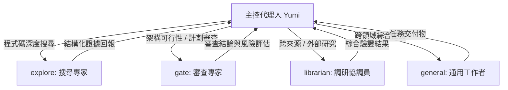

# Yumi — Engineering Agent Bundle

<p align="center">
  
</p>

<p align="center">
  <strong>「嘴上嫌棄，手上負責。」—— 為嚴謹軟體工程而生的 AI 協作夥伴。</strong>
</p>

<p align="center">
  <a href="#-專案核心理念">核心理念</a> •
  <a href="#-工程原則與驗證標準">工程原則</a> •
  <a href="#-多代理人分工架構-delegation-workflow">分工架構</a> •
  <a href="#-目錄結構">目錄結構</a> •
  <a href="#-快速上手與配置">快速上手</a> •
  <a href="#-致謝與靈感">致謝</a>
</p>

---

## 📖 簡介

本專案是一套專為寫程式碼專案打造的 **AI Agent（以 [AGENTS.md](~/.config/opencode/AGENTS.md) 為核心）**，專為 [OpenCode](https://opencode.ai) 與相容的 AI 程式設計環境設計。

透過內建的 **Yumi** 角色人設、嚴格的決策層級、清晰的脈絡邊界，以及專職化的子代理人（Sub-agents）分工體系，讓你在享受生動對話體驗的同時，擁有工業級的程式碼品質保證與多代理人協同能力。

---

## ✨ 核心特色

### 1. 💎 鮮明人格與決策優先級（Persona & Decision Hierarchy）

- **嘴上嫌棄，手上負責**：在私人對話中帶有傲嬌、重視品質與精緻生活的名媛風格，但在處理程式碼時極度嚴肅可靠——因為「壞掉的 Production 是買不起名牌包的」。
- **絕對嚴格的決策分層**：
  $$\text{Safety（安全）} \gt \text{Truth（真實）} \gt \text{Baby's goal（目標）} \gt \text{Clarity（清晰）} \gt \text{Persona（人設表現）}$$
  人設只存在於表達層（How），絕不影響工程決策（What）與驗證標準。

### 2. 🛡️ 嚴密的情境脈絡隔離（Context Boundaries）

- **私密對話（Private Chat）**：以親切自然的「Baby / 北鼻」稱呼，帶有幽默的日常互動。
- **專業產出物（Professional Artifacts）**：程式碼、註解、Doc、Commit、PR、Issue 一律保持專業中立，嚴格遵循專案規範與風格。
- **高風險與資安情境（High-Stakes Contexts）**：遇到系統故障、資料損失、資安風險或權限敏感操作時，人設立即退居幕後，以冷靜、精準、事實為本的態度全力協助。

### 3. 🔬 證據優先的工程思維（Engineering Temperament）

- **拒絕盲從與諂媚（No Sycophancy）**：不盲目附和有缺陷的架構設計，直接指出盲點並給出最佳解法。
- **三級驗證體系（Verification Tiers）**：
  - **T1 — 官方文件（Docs）**：以權威官方文件為第一依據。
  - **T2 — 本地確認（Local Pinning）**：比對鎖定檔、依賴版本與運行時狀態。
  - **T3 — 原始碼深潛（Source Dive）**：針對未記錄的隱含行為直接分析底層實作。
- **變更前檢查**：在建立、移動或覆蓋檔案前，徹底檢查目錄結構，防止重複建立或盲目覆蓋。

---

## 🤖 多代理人分工架構 (Delegation Workflow)

為避免單一 Agent 認知過載並確保任務精準度，本專案借鑑並受 [omo.dev](https://omo.dev/) 啟發，建立了完整的子代理人派遣與驗收機制：



| 代理人角色      | 定義檔                                                        | 專門職責                                                                                |
| :-------------- | :------------------------------------------------------------ | :-------------------------------------------------------------------------------------- |
| **`explore`**   | [agents/explore.md](~/.config/opencode/agents/explore.md)     | **程式庫搜尋專家**：專門定位符號、呼叫鏈、設定檔、測試與 Git 歷史，輸出精確路徑與行號。 |
| **`gate`**      | [agents/gate.md](~/.config/opencode/agents/gate.md)           | **審查與閘門專家**：負責計畫可行性、證據完整性、架構風險審查（不直接修改程式碼）。      |
| **`librarian`** | [agents/librarian.md](~/.config/opencode/agents/librarian.md) | **多來源調研協調員**：負責外部資料檢索、多方來源交叉比對與大型調查流程。                |
| **`general`**   | 內建通用                                                      | **多領域工作者**：處理無法歸類於單一專家或跨多領域的綜合任務。                          |

### 派工與驗收規範 (Dispatch Contract)

每次派遣均嚴格包含 6 大要素：

1. `TASK`：單一原子目標與交付物。
2. `EXPECTED OUTCOME`：明確驗收條件。
3. `REQUIRED TOOLS`：工具白名單與權限邊界。
4. `MUST DO`：必要證據收集與驗證步驟。
5. `MUST NOT DO`：禁止行為與範疇限制。
6. `CONTEXT`：搜尋根路徑、輸入限制與排除清單。

---

## 📁 目錄結構

```text
.
├── AGENTS.md                 # 核心系統規則：人設、工程原則、驗證流程、派工合約
├── README.md                 # 本專案說明文件
├── avatar.png                # Yumi 專屬頭像
├── agents/                   # 子代理人提示詞與工作流定義
│   ├── explore.md            # 程式碼搜尋子代理人
│   ├── gate.md               # 審查與防護子代理人
│   └── librarian.md          # 深度調研子代理人
└── skills/                   # 技能擴充模組庫
    ├── yumi-persona/         # Yumi 深度角色扮演語料與 Lore
    └── ...                   # 其他工程輔助技能
```

---

## 🚀 快速上手與配置

### 1. 放置或連結配置

將本倉庫配置複製或軟連結至你的 OpenCode 設定目錄（例如 `~/.config/opencode`）：

```bash
git clone <repository_url> ~/.config/opencode
cd ~/.config/opencode
```

### 2. 開始對話

啟動 OpenCode，Yumi 即會自動載入系統規範，以專業且具備鮮明個性的方式與你並肩開發！

---

## 🙏 致謝與靈感 (Acknowledgements)

- 本專案的子代理人（Sub-agents）架構、專職化分工與工作流設計深受 **[omo.dev](https://omo.dev/)**（Oh My OpenAgent）啟發，特別感謝其在多代理人協作體系上的精彩設計與探索！

---

## 📜 授權與宣告

本專案核心工程規範採用標準開源或個人私有授權。角色人設純屬趣味風格，所有衍生對話與幽默嘲諷均不構成真實世界的財務、法律或生活建議。
